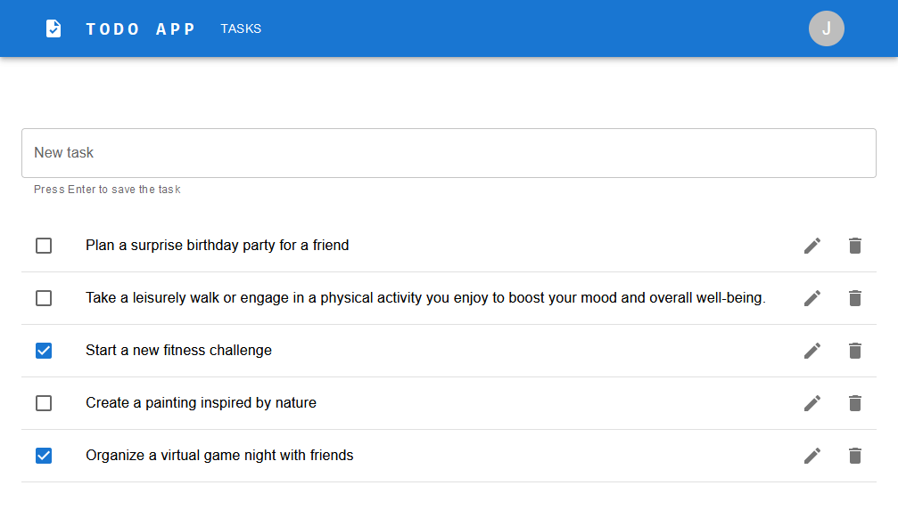

# TODO APP

Tech stack: Spring Boot 3, Postgres, Liquibase, Maven, React, TypeScript, GitHub Actions

### Requirements:

Java 17

Docker Desktop (https://www.docker.com/products/docker-desktop/)

Node.js 18 (https://nodejs.org/en/download)

## How to run

### Backend:

    docker-compose up -d --wait && mvnw spring-boot:run

### React frontend

    cd src\main\frontend
    npm install
    npm run start

## Frontend URL

    http://localhost:8081/todo-app/

## Login credentials

    username: John
    password: JohnPassword

    username: Alice
    password: AlicePassword

## CI/CD pipeline

    https://github.com/redshift-7/todo-app/actions

### Frontend deployed to GitHub Pages

    https://redshift-7.github.io/todo-app/

## Tracing

Actuator endpoint:
        
    http://localhost:8080/actuator/httpexchanges
